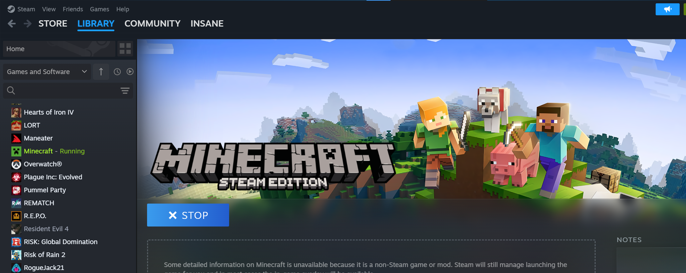

# Minecraft Steam Bridge App 🎮

A lightweight Windows utility that lets you launch Minecraft through Steam and have it correctly show as "Playing" in your Steam status.




---

## Setup

1. Download `Minecraft_Steam_Bridge.zip` from the [Releases](../../releases/latest) page
2. Extract the zip anywhere on your PC (e.g. `C:\Games\Minecraft Steam Bridge\`)
3. Open Steam and go to **Library → Add a Game → Add a Non-Steam Game**
4. Click **Browse** and select `minecraft_steam.exe`
5. Click **Add Selected Programs**

That's it. Launch Minecraft from Steam and your status will show correctly.

🎨 Customising Your Steam Entry (Name, Icon, Artwork)
Want Minecraft to look proper in your Steam library with the right icon, cover art, and hero image? This YouTube video walks through the full customisation process — just follow along but use minecraft_steam.exe as your target instead of Minecraft.exe:

[📺 Add Minecraft To Steam Library by Tinox412](https://www.youtube.com/watch?v=yk2vDgGguV8)

---

## Custom Install Path

If your Minecraft Launcher isn't in the default `C:\XboxGames\` location, then edit the config file.

On first launch, the app automatically creates a `config.txt` in the same folder as the `.exe`. Open it with any text editor and update the path to match your install:

```
# Minecraft Steam Bridge App - Config
# Set the full path to your Minecraft Launcher .exe below
launcher_path=C:\XboxGames\Minecraft Launcher\Content\Minecraft.exe
```

Save the file and relaunch the app. If the path doesn't exist or doesn't point to a `.exe`, the app will close.

---

## How It Works

1. `minecraft_steam.exe` launches `Minecraft.exe` directly
2. It waits for the `Minecraft.exe` process to appear
3. It polls every 3 seconds to check if the launcher is still running
4. When you close the Minecraft Launcher, the bridge exits automatically

Steam sees `minecraft_steam.exe` running the entire time — so your "Playing" status stays active throughout your session.

---

## Build from Source

**Requirements:** Python 3.8+

```bash
# Clone the repo
git clone https://github.com/InsaneCipher/MinecraftSteamApp.git
cd MinecraftSteamApp

# Install dependencies
pip install pyinstaller psutil

# Build the .exe
pyinstaller --onefile --noconsole --icon=minecraft_steam.ico minecraft_steam.py        
```

Your `.exe` will be in the `dist/` folder.

---

## License

MIT — do whatever you want with it.
